# Static IP and Time zone
Noting Here bc its a place holder

## Host Name anderen
Wir mussen unsere Host name andere so das wir in der zufkunf unsere server einfach erkkerne konnen. Das ist auch wichtig wenn wir nacher eine domain erstellen was wird von der Host name ubernommen.

### Process
1. Auf das linke seite drucken auf das "Local Server"
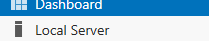

Dann in der server properties seihst du die "Computer Name"
2. Drucke auf das "Computer Name"
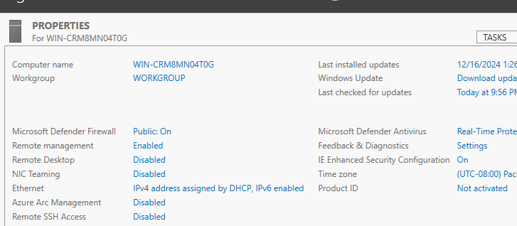
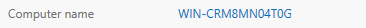

3. Drucke auf "change"
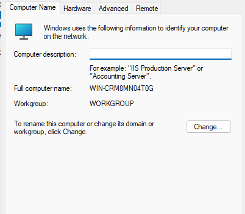

Und heir wirds du Eien eigene name wahlen fur deine Server, es ist epholen eine name nach der Firma Names konzept zu gehen, aber das ist nicht zwangshaft
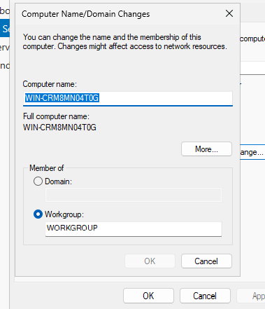
4. Gebe das Name euren server ein
5. Drucke Auf "OK"
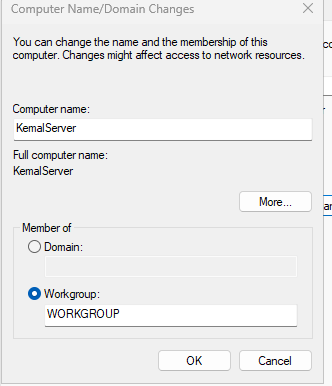
Um die andereungne zu ubernehmen muss du deine gerat neu starten
6. Drucke auf Ok

Du werdest auch nochmal informiert das du musst deine pc neu starten
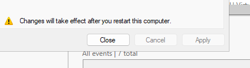

7. Wahle "restrart now"
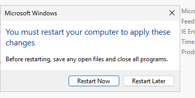

Warte Bis deine Server Neu Startet

### Teste
Um zu sehen ob unsere Server Mit der Neue Name konfiguriert ist mussn wir es in der local server properties Uberprufen.

Wenn der server hochgeafhren ist
8. Offnen sie Server Manager.
9. Gehen sie auf Local Server

Und unter "Properties" Wrist du sehehn das der server mit der neuen name konfiguriert ist.
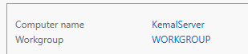

wenn das nicht der fall ist, machen sie die schritte nochmal

# AD DS
Active Directory (AD) ist eine weit verbreitete Windows-Software, die Administratoren ermöglicht, ein gesamtes Netzwerk zentral zu verwalten. Mit Active Directory gehören die Zeiten der Vergangenheit an, in denen jedes einzelne Gerät wie PCs, Laptops und mobile Geräte manuell konfiguriert werden musste.
AD bietet eine zentrale Plattform zur Verwaltung von Benutzern, Geräten, Gruppenrichtlinien, Sicherheitsrichtlinien und Zugriffsrechten. Dadurch wird die Verwaltung großer Netzwerke effizienter, sicherer und konsistenter.

## Installation
1. Starte eure VM, und logge euch ein
2. Offnen Serve Manager

3. Auf Der Dashboard druchke auf add roles and Feautres (Das Nummmer 2)
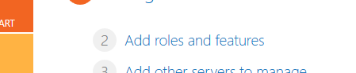 

4. Lessen sie die einleitung durhc, und drucken sie OK
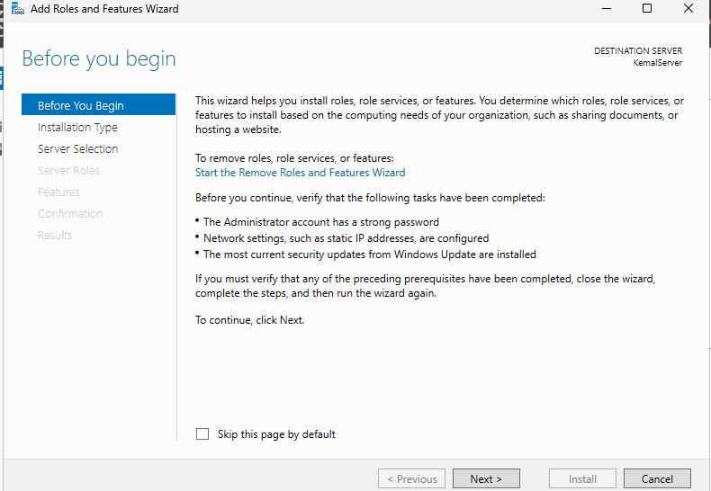

5. Wahle Role Based Installation und Drucke OK
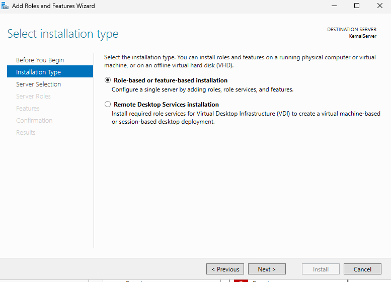

6. Wahle Deine Server, Pass Gut auf das es Deine Server ist.
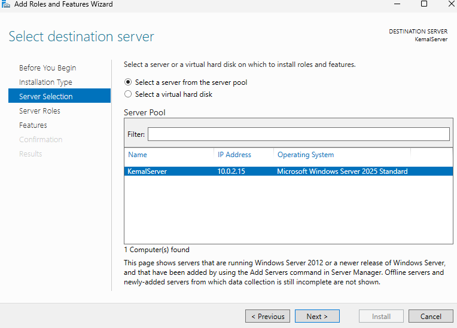
Sie konen heir auch die IP uberprufen und das computer name, wenn diese paratmetre nicht stimmen ich ephele das sie es heir abrechen und die parameter anderen

7. Finde "Active Directory Domain Serveces" In das Liste
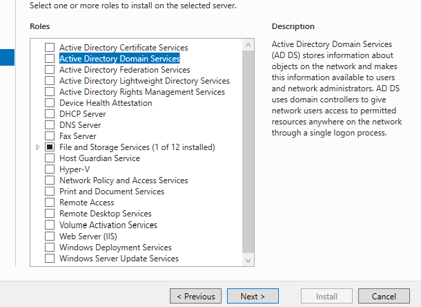

8. Selectire die Modul
9. Drucke auf Add Feautres
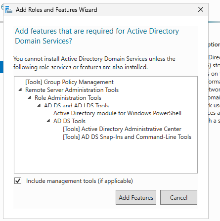

Uberpruffe das es Selektirert ist
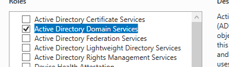 

10. Drucke auf next
11. Schau das "Group Polices Management" ausgewahlt ist
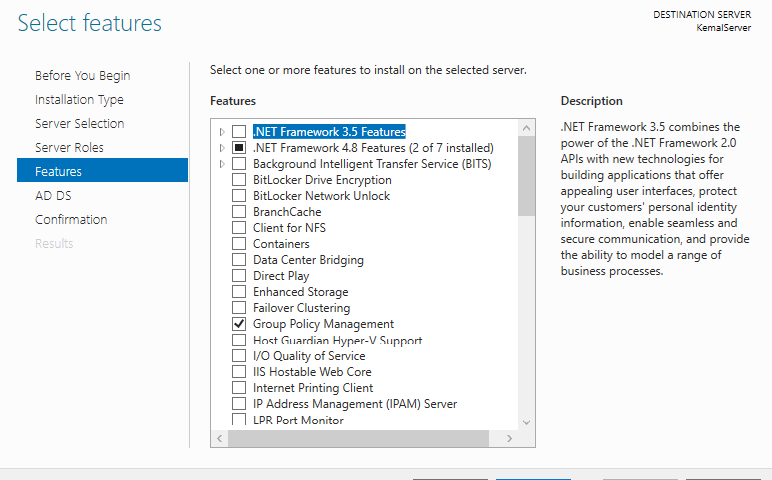
Wenn das nicht der fall wahre, selektiren sie es maneuel
12. Drucke auf next

Der serve wird dir informacion ubder das AD geben, wenn sie wollen Lessen sie es druch.

13. Drucke auf next

Heir wirds du eine uberblick von die modulen bekommen die instaliert werden. Bitte sahuen sie an, nutze deiser photo als eine beispliel
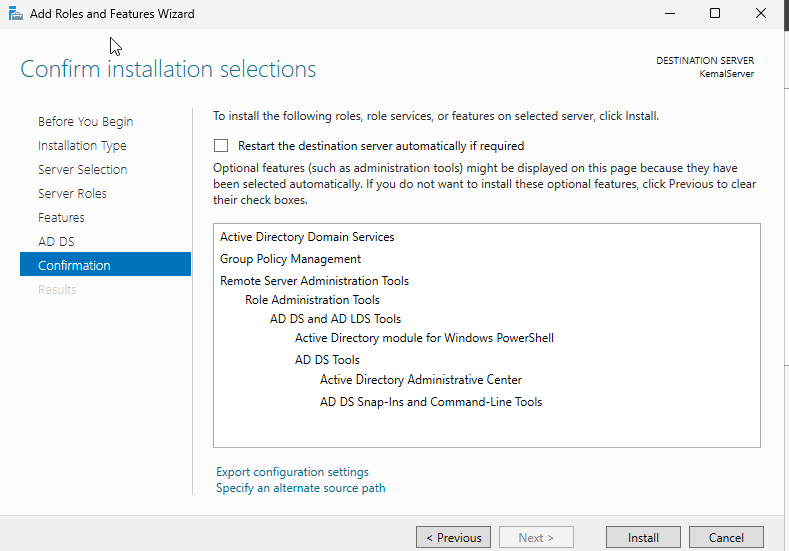
14. Drucke auf Install

Lassen sie der Installation Laufen bis es Fertig ist
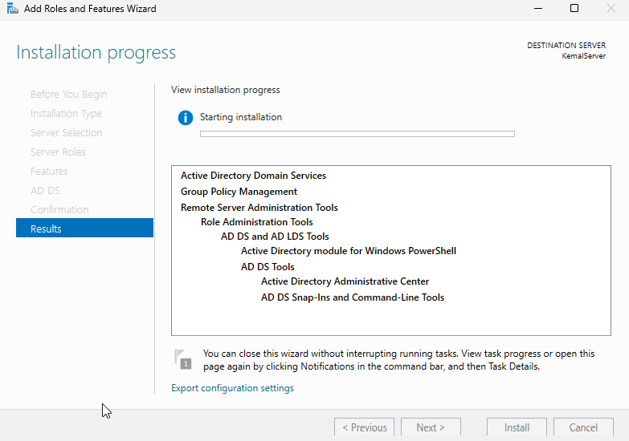

Wenn es fertig wird,
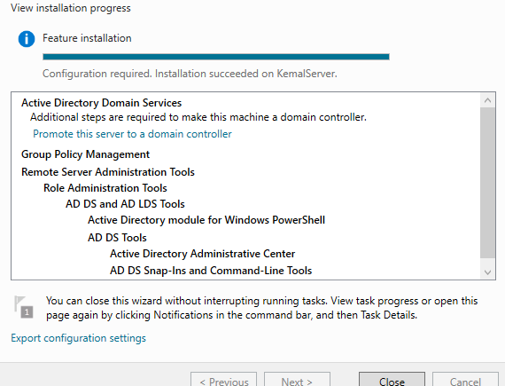
15. Drucken sie auf "Close"

Sie haben jetz geschaft die AD DS moudl zu instaliren, Es fehlt noch der Modul zu konfiguriert

## Configuration
Es ist notig fur das Funkzionalitat der Active Directory zu konfiguriert, Ohne eine richtigen konfiguration wird der AD DS Nicht fukzioniren.

Nahc der Installation wird Die flagge in das obbere Rehcte ecke mit eine warn sybole sein, das ist sozusagen eine signal das etwas muss getan werden um die Installation feritg zu stellen.

1. Drucken sie auf das flagge

Sie werden sehen das es eine "Post deplomyent Configuration" Gibts
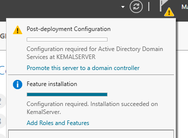

## Groups and Users

## Cleitn Tests

## Conectivity

# DNS
Siro is doing this

# DCHP
Noting here

# Printing Server
