# Static IP and Time zone
Noting Here bc its a place holder

## Hostname ändern
Wir müssen unseren Hostnamen ändern, damit wir in Zukunft unsere Server einfacher identifizieren können. Das ist auch wichtig, wenn wir später eine Domain erstellen, da diese oft vom Hostnamen übernommen wird.

### Prozess
1. Auf der linken Seite auf "Local Server" klicken.  
   

   In den Servereigenschaften siehst du den aktuellen "Computer Name".

2. Klicke auf "Computer Name".  
     
   

3. Klicke auf "Change".  
   

   Hier kannst du einen neuen Namen für deinen Server wählen. Es wird empfohlen, einen Namen nach dem Namenskonzept deiner Firma zu wählen, aber das ist nicht zwingend erforderlich.  
   

4. Gib den neuen Namen deines Servers ein.

5. Klicke auf "OK".  
   

   Um die Änderungen zu übernehmen, musst du dein Gerät neu starten.

6. Klicke auf "OK".  
   

   Du wirst erneut informiert, dass du deinen PC neu starten musst.  
   

7. Wähle "Restart now".  
   

   Warte, bis dein Server neu gestartet ist.

### Testen
Um zu überprüfen, ob der neue Name korrekt konfiguriert wurde, müssen wir die Einstellungen in den lokalen Servereigenschaften überprüfen.

8. Öffne den Server Manager.  
9. Gehe zu "Local Server".  
   

   Unter "Properties" wirst du sehen, dass der Server mit dem neuen Namen konfiguriert wurde.  
   

Wenn das nicht der Fall ist, wiederhole die Schritte.

# AD DS
Active Directory (AD) ist eine weit verbreitete Windows-Software, die Administratoren ermöglicht, ein gesamtes Netzwerk zentral zu verwalten. Mit Active Directory gehören die Zeiten der Vergangenheit an, in denen jedes einzelne Gerät wie PCs, Laptops und mobile Geräte manuell konfiguriert werden musste.

AD bietet eine zentrale Plattform zur Verwaltung von Benutzern, Geräten, Gruppenrichtlinien, Sicherheitsrichtlinien und Zugriffsrechten. Dadurch wird die Verwaltung großer Netzwerke effizienter, sicherer und konsistenter.

## Installation

1. Starten Sie Ihre VM und melden Sie sich an.
2. Öffnen Sie den Server Manager.

3. Klicken Sie im Dashboard auf **"Add Roles and Features"** (Schritt 2).
   

4. Lesen Sie die Einführung und klicken Sie auf **"OK"**.
   

5. Wählen Sie **"Role-based or feature-based installation"** und klicken Sie auf **"Next"**.
   

6. Wählen Sie Ihren Server aus. Achten Sie darauf, dass der richtige Server ausgewählt ist.
     
   Sie können hier auch die IP-Adresse und den Computernamen überprüfen. Wenn diese Parameter nicht übereinstimmen, brechen Sie den Vorgang ab und passen Sie die Einstellungen an.

7. Suchen Sie **"Active Directory Domain Services"** in der Liste.
   

8. Markieren Sie das Modul.
9. Klicken Sie auf **"Add Features"**.
   

10. Überprüfen Sie, ob das Modul ausgewählt ist.
    

11. Klicken Sie auf **"Next"**.
12. Stellen Sie sicher, dass **"Group Policy Management"** ausgewählt ist.
      
    Falls dies nicht der Fall ist, wählen Sie es manuell aus.

13. Klicken Sie auf **"Next"**.

Der Server zeigt Ihnen Informationen über AD an. Lesen Sie diese bei Bedarf durch.

14. Klicken Sie auf **"Next"**.

An dieser Stelle sehen Sie eine Übersicht der zu installierenden Module. Überprüfen Sie diese anhand der folgenden Abbildung:
   

15. Klicken Sie auf **"Install"**.

Warten Sie, bis die Installation abgeschlossen ist.
   

16. Sobald die Installation fertig ist, klicken Sie auf **"Close"**.
   

Sie haben nun das AD DS-Modul erfolgreich installiert. Als nächstes muss das Modul konfiguriert werden.

## Configuration
Es ist notig fur das Funkzionalitat der Active Directory zu konfiguriert, Ohne eine richtigen konfiguration wird der AD DS Nicht fukzioniren.

Nahc der Installation wird Die flagge in das obbere Rehcte ecke mit eine warn sybole sein, das ist sozusagen eine signal das etwas muss getan werden um die Installation feritg zu stellen.

1. Drucken sie auf das flagge

Sie werden sehen das es eine "Post deplomyent Configuration" Gibts

2. Drucken Sie auf "Promote the Server to Domain Controler"
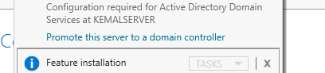

Du wirds dieser menu bekommen, wie der Installtions menu das ist anlich und wrids gelich ablaufen.
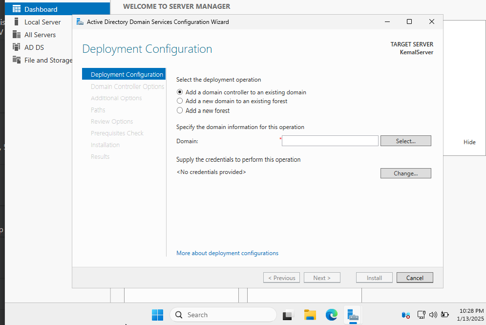

3. Drucke auf Add new forest

Was ist eine Forest?
/////////////////

gebe Deine Domain eine Domain name. Das wird spatter von der DNS verwalten.
Der AD Modul benotigt eine FQDN, und wrid keine einfache name in der domain name.
Du must eine TLD haben, ohne eine TLD wird der Server der name Ncith akzeptiren. 

4. Schreibe deine Domain Name rein
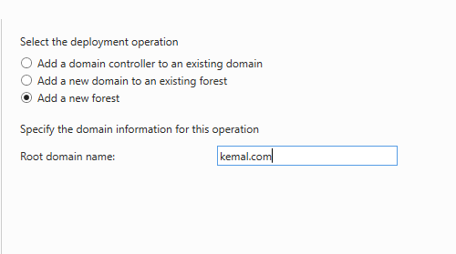

wenn sie verscheiden servern und forst haben auf eine server es kann dazu fuhren das die auf verschidene Infrascrucutre funkzioneiren. Deswegen ist es jetz nicht so wichtig in unsere fall aber sie nacher auf eine andere infracscurete eine Forest erstellen wollen. Mussen sie enschprechend wissen weche aus zuwahlen

5. Wahle die Windwos Server 2025
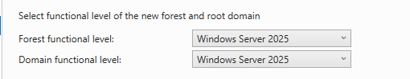

Welche funkzionen soll diesr dns server haben. Du hast die auswahl das zu bestimmen.

6. Wahle DNS
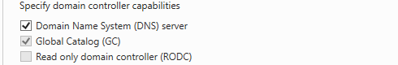

Dieses password musen sie merken wegen es wird wichtig spatter, wenn wir die clients einloggen und mir Der AD verbinden.

7. Schreibe eine Passoword rein, Und Drucke Weiter

Wir Brauchen keine DNS delegation zone, Wegen das wird eine simplen AD + DNS Setup.

8. Drucke Weiter

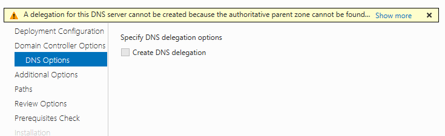

Das Netbios ist das name was die Cleint Gareten werden sehen wenn die mit der AD verbunden sind, das ist die name von der server das wird zu das end user sehebar

9. Schribe die Name rein, Durkce weiter

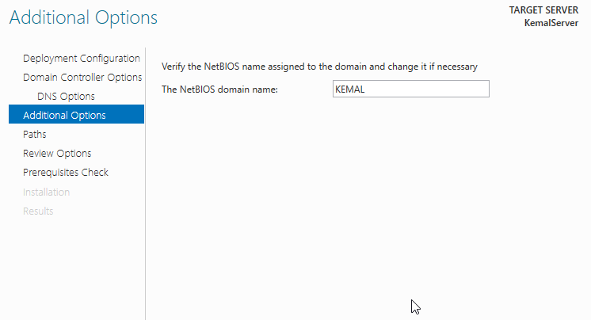

Hier kannst du die Phaden zu das data an der server andren. Das ist wichtig wenn du willst das die data auf eine andre disk oder dirve geschpeichertwerden soll. Wir nutzen die Default wengen wir haben nur eine dirive.

10. Drucke weiter

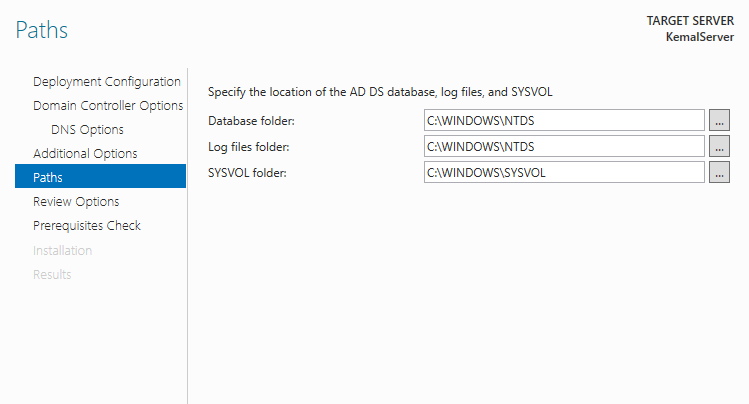

Heir gibts eine revwei, sher epholen die settings an zu schauen bevor du weiter gehst. Nutze meine Screenshots als eine Template.

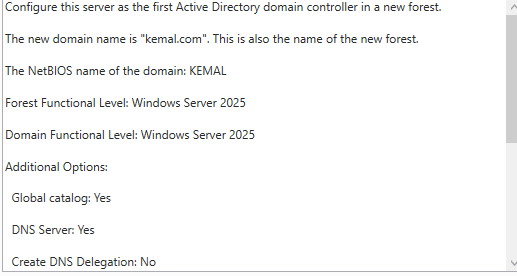

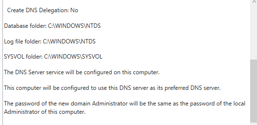

11. Drucke weiter

Lass Windows server 2025 Die Settigns einstellen und die ubernehmen. Es wird auch shaeun das der Server hat die benotigte resurcen und Modulen dieser weiter zu mahcen.

Es ist nicht eine grosses problem wenn eineige warnunge heir auftacuhen, wir benotigen weinger modulen als die normal auf eine serve sich befinden

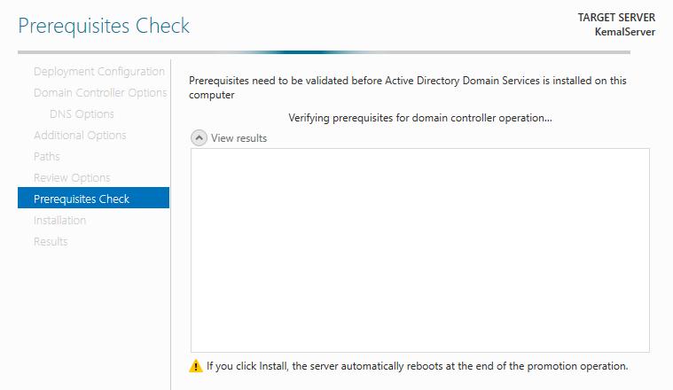

Heir in unsere fall tauchen zb einige Probleme mit der Netwrok adapter wengen das eine VM ist. WIr konnen die Ignoriren fur der ziet wegen es wird nicht viel andere sein als waren wir auf einer echten server.

12. Drucke auf Install

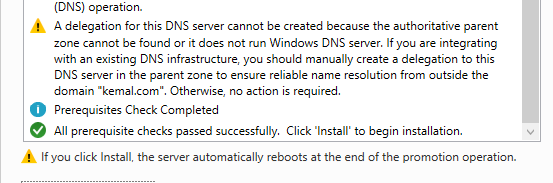

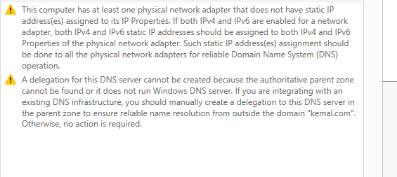

Nahc diser Opertaiton wrid der Server selber Neustarten. 

Mit Der erste tiel der instalation von Das Active Directoy sind wir feritg. Wir werden mit der Grupen und Unsern Nacher weiter machen. Aber bvor das bentoige wir einige Modulen.

# DNS
Siro is doing this

# DCHP
Noting here

## Groups and Users AD

### Infos / Theorie

Wir haben die DNS Und Das DCP konfiguriert, jetz so das unsere AD Mit Unser Gefuhlt werden kann schauen wir uns an wie mann Unser und Organistaion Units machet in AD.

*Grund Begreife* 

Organistoan Untis sind wie abtielungen, die sind da um usern Directorys und sontstiges zu behalten. Mann kann meherere usern und Directorys uber eine organistational unti verwalten. 

Usern an der AD, Usern sind die Besntand teil der AD wir konenn die nutzetn um leute in der AD zu verbinden und zusamnen zu bringen. Die konnen eine veilatligkeit an Moglichkeiten zur verwaltung haben wie: Cloud Hoems, Cloud Storange, VMs um ins netz zu arbeiten und auch configuraitosn so das auf jeder comptuer konenn die gelich und einfahc arbeitenn.

Folder, an der AD konenn wir foldern erstellen wo wir data und Inforamtionenn reinmachen konnen, die nutuzen uns wie File Shares aber afu eine bessere nuvea

----

### Organistaion Units

1. Von der Server Maneger In der Obberen Ecke Drucke auf "Active Directoy User and Servicecs"
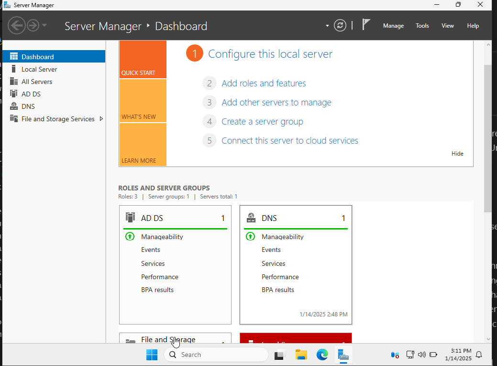
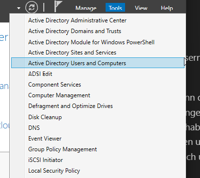

an der linken seite befindent sich die active domains in diene Network
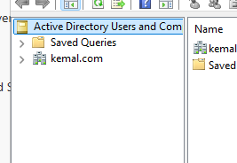

Heir ist das Domain kemal.com die wir vorher gemacht haben.

2. Drucke auf Der Main Domain

Heir befinden sich die utnere Direcotrs fur das AD. Heir findete man Alle Directos in eine spezifische Domain. Du kannst alle anderungne was auf netz geht.

3. Rechte Maus taste drucke auf das Domain
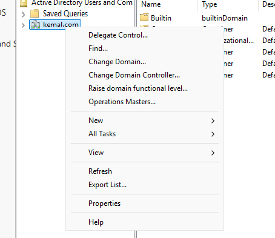

4. Drucke auf new
5. Wahle Organistaon Unti 
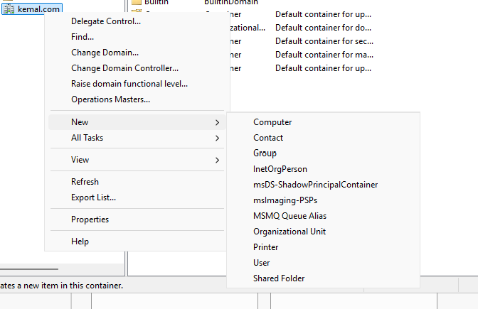
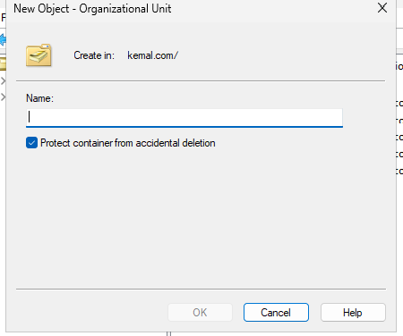

Heir kannst du selber auswahlen was fur eine Namesn kozept deinser organistoan Untis. Es kann sein das sie wollen fur jede Ablteilung eine Organsitoan Unit machen. Order ware das auf eine sub domain. dass kommt auf der Planung drauf.

6. Schreibe die name von deinser Unti. Und Drucke auf Ok
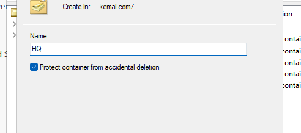

Jetz ist eine Organistton unti kreiert. 

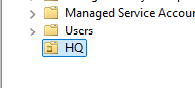

Was eine sher colle moglichkeit ist das wir unter diesr unti noch einige organisaotl untis machen konnen

Zb in meiner situation wo wir einige abteilungen haben werde ich die abteilungne in verschidenen organistoaon untis uterteilen so das die seperat von ein andere fukzioniren konenn.

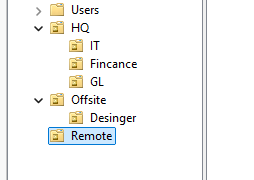

Wenn wir die Organsination untis gemahct haben, gehen wir fort mit der user kreation. Users sind Gleich wie die Local users auf PC aber in disenm fall wird das auf das server geshpeichert. Die sind auf das server geschpecihet und es gibt uns sehr viele verwalungs methoden

### Normale User

um users zu kreiren

1. Wir drucken auf eine organisotan Unti mit der Rechte Maus taste
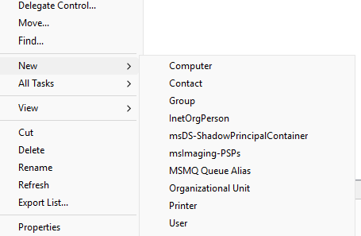
2. Unter new, Users
3. Schreibe die notige Information zu den user
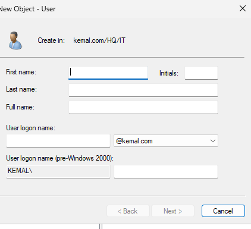
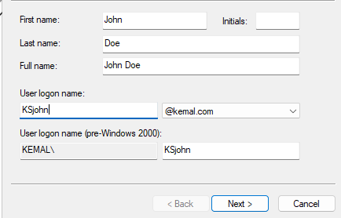
Wenn die inforamtion drin sind Drucke "Next"

4. Gebe die User eine password
Gebe die user eine Starke und sicherre Passorwd. 
5. Unselektire "User muss change password on login"
Diser schritt ist epholen, Wegen wir werden keine echten users drauf hauben und mehrre passswords zu tracken ist schwerig wegen es wird kompelzitat in der prozess reinbringne.
So besser eine password die wir setzen so das wir es merken
6. Kurze reveiw, Wenn alles stimmt drucke weiter
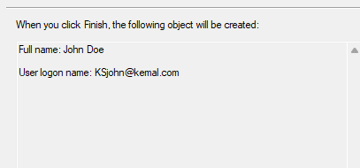

heir ist unsere kreitere user:
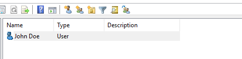
Mit dem werden wir spatteer in das cleint system einloggen und dadurhc auf das ad zu grieffen

### Admin User
Wir brauhen eine addmin user so im fall wenn wir wollen ins AD zugfrien und administiren wollen so das wir es Remote machen konnen. Ohne das wir in der server reinloggen zu mussen

1. Mache alle schrite aus der Normale User
2. Rechte maustaste auf das user
3. Drucke auf Propertiest
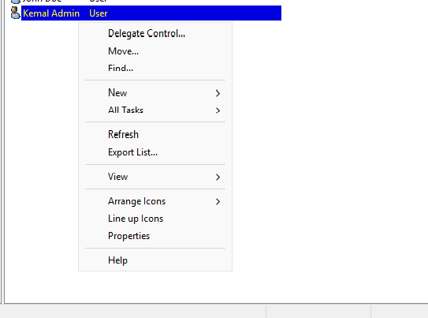
4. Drucke auf Member of
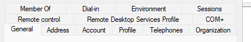
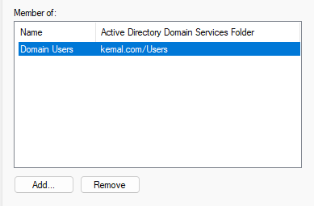

Heir sind Die Gruppen die an der user angehegt sind.
Wir werden diser user die gruppe "Domain Admin" geben. mit dieser Group werden wir nacher die computer an usenre netz verdingen. Ohne diser perminsions konnen wir erweiterte rescorscens zugreiffen.

5. Drucke auf add
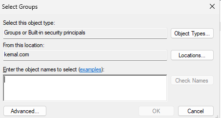
6. Schreibe "Adminstrators" rein und drucke Enter
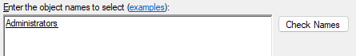
7. Schreibe "Domain Admin" rein und drucke Enter
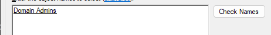
8. Drucke auf ok und schliessen die menu

Ab jetz sind wir fertig mit der konfiguriren auf der server. Um Cleitns in der netz zu verbinden mussen wir einige einstellungen auf das cleinside machen so das es funkzioneiren wird.

## Cleitn Tests

Wir Brauchen Eine zusatliche VM, Das sollte entweder Windows 10 oder windwos 11 sein.

Wir mussen auf die Vms 3 sachen machen:
* PC name anderen
* Domain hinzufugen
* Testen

**wichtig**
In der Network manager der VM, mussen sie sicher stellen das es in der gelichen Netzwerk ist wie das Server. Wenn das nicht der fall ware gehen sie zu der VM Network konfiguration in diser dokumet. Da wirds ausfuhrlich beschreiben wie mann das macht.

1. Starte die Cleint VM

2. Logge dich rein mit der Local User
3. Ofnnen sie der File Explorer
4. Gehe auf This PC
5. Drucke in das Feld mit der Rechten Maus taste
6. Gehe auf Properties
7. Drucke auf das "Rename this PC"
8. Schreiben sie der Name des PC die wir nacher in das AD sehen werden

unter dieser menu stehet "member of" Da hats 2 optioen:
* Domain
* Workgroup

9. Wahle die Domain (Deisem fall"kemal.com")
10. Neu starten

Nach der Neu start
11. Wahlen sie unten rehcts "Other User"

Uberprufen sie das es eine weise text unter der passowrd feld gibt was steht "Sign in to: Kemal"

wenn es so stheret bedutet das wir werden mit der Domain eingelogt und Ncith mit der Local user.

12. Geben sie die Username von einer die user die wir fruhner kreiert haben.

13. Ofnnen sie der File Explorer
14. Gehe auf This PC
15. Drucke in das Feld mit der Rechten Maus taste
16. Gehe auf Properties

Unter device specifactions, schauen sie der Full device name an.
wenn es mit der Domain Endet das bedutet das wir geschaft haben die Cleitns ins netz zu brigen.

## Checks

# Printing Server
