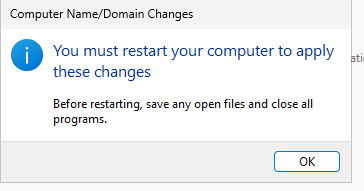
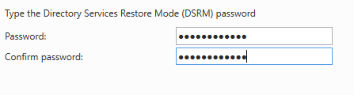
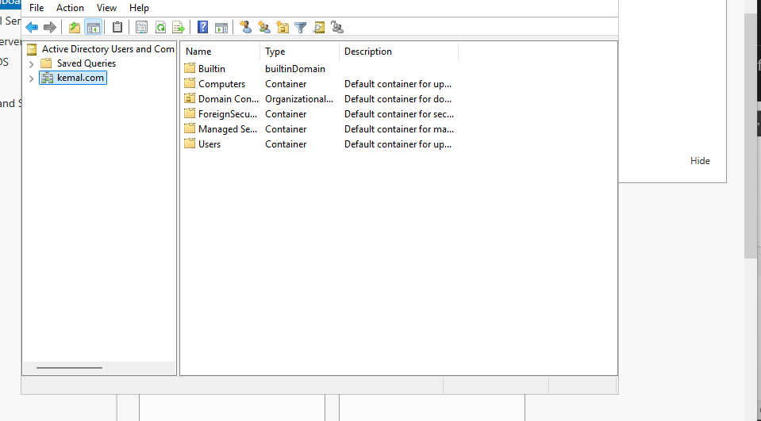
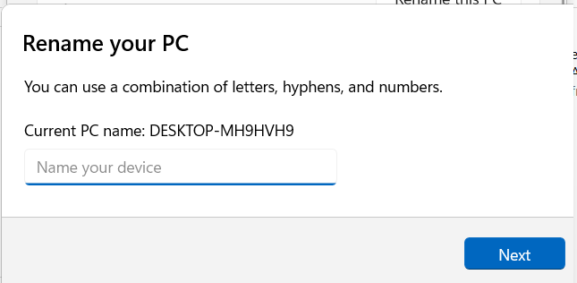

# Static IP and Time zone
Noting Here bc its a place holder

## Hostname ändern
Wir müssen unseren Hostnamen ändern, damit wir in Zukunft unsere Server einfacher identifizieren können. Das ist auch wichtig, wenn wir später eine Domain erstellen, da diese oft vom Hostnamen übernommen wird.

### Prozess
1. Auf der linken Seite auf "Local Server" klicken.  
   

   In den Servereigenschaften siehst du den aktuellen "Computer Name".

2. Klicke auf "Computer Name".  
     
   

3. Klicke auf "Change".  
   

   Hier kannst du einen neuen Namen für deinen Server wählen. Es wird empfohlen, einen Namen nach dem Namenskonzept deiner Firma zu wählen, aber das ist nicht zwingend erforderlich.  
   

4. Gib den neuen Namen deines Servers ein.

5. Klicke auf "OK".  
   

   Um die Änderungen zu übernehmen, musst du dein Gerät neu starten.

6. Klicke auf "OK".  
   

   Du wirst erneut informiert, dass du deinen PC neu starten musst.  
   

7. Wähle "Restart now".  
   

   Warte, bis dein Server neu gestartet ist.

### Testen
Um zu überprüfen, ob der neue Name korrekt konfiguriert wurde, müssen wir die Einstellungen in den lokalen Servereigenschaften überprüfen.

8. Öffne den Server Manager.  
9. Gehe zu "Local Server".  
   

   Unter "Properties" wirst du sehen, dass der Server mit dem neuen Namen konfiguriert wurde.  
   

Wenn das nicht der Fall ist, wiederhole die Schritte.

# AD DS
Active Directory (AD) ist eine weit verbreitete Windows-Software, die Administratoren ermöglicht, ein gesamtes Netzwerk zentral zu verwalten. Mit Active Directory gehören die Zeiten der Vergangenheit an, in denen jedes einzelne Gerät wie PCs, Laptops und mobile Geräte manuell konfiguriert werden musste.

AD bietet eine zentrale Plattform zur Verwaltung von Benutzern, Geräten, Gruppenrichtlinien, Sicherheitsrichtlinien und Zugriffsrechten. Dadurch wird die Verwaltung großer Netzwerke effizienter, sicherer und konsistenter.

## Installation

1. Starten Sie Ihre VM und melden Sie sich an.
2. Öffnen Sie den Server Manager.

3. Klicken Sie im Dashboard auf **"Add Roles and Features"** (Schritt 2).
   

4. Lesen Sie die Einführung und klicken Sie auf **"OK"**.
   

5. Wählen Sie **"Role-based or feature-based installation"** und klicken Sie auf **"Next"**.
   

6. Wählen Sie Ihren Server aus. Achten Sie darauf, dass der richtige Server ausgewählt ist.
     
   Sie können hier auch die IP-Adresse und den Computernamen überprüfen. Wenn diese Parameter nicht übereinstimmen, brechen Sie den Vorgang ab und passen Sie die Einstellungen an.

7. Suchen Sie **"Active Directory Domain Services"** in der Liste.
   

8. Markieren Sie das Modul.
9. Klicken Sie auf **"Add Features"**.
   

10. Überprüfen Sie, ob das Modul ausgewählt ist.
    

11. Klicken Sie auf **"Next"**.
12. Stellen Sie sicher, dass **"Group Policy Management"** ausgewählt ist.
      
    Falls dies nicht der Fall ist, wählen Sie es manuell aus.

13. Klicken Sie auf **"Next"**.

Der Server zeigt Ihnen Informationen über AD an. Lesen Sie diese bei Bedarf durch.

14. Klicken Sie auf **"Next"**.

An dieser Stelle sehen Sie eine Übersicht der zu installierenden Module. Überprüfen Sie diese anhand der folgenden Abbildung:
   

15. Klicken Sie auf **"Install"**.

Warten Sie, bis die Installation abgeschlossen ist.
   

16. Sobald die Installation fertig ist, klicken Sie auf **"Close"**.
   

Sie haben nun das AD DS-Modul erfolgreich installiert. Als nächstes muss das Modul konfiguriert werden.

## Configuration

Es ist notwendig, Active Directory (AD) korrekt zu konfigurieren, da der AD DS-Dienst ohne eine ordnungsgemäße Konfiguration nicht funktionieren wird.

Nach der Installation erscheint ein Warnsymbol in der oberen rechten Ecke des Server Managers. Dieses Signal weist darauf hin, dass weitere Schritte erforderlich sind, um die Installation abzuschließen.

1. **Klicken Sie auf das Warnsymbol (Flagge)**.
   

   Sie sehen nun die Option **"Post Deployment Configuration"**.
   

2. **Wählen Sie "Promote the Server to a Domain Controller"**.
   

   Ein Menü wird angezeigt, das dem Installationsmenü ähnelt. Die Konfigurationsschritte verlaufen ähnlich.
   

### Forest erstellen
3. **Wählen Sie "Add a new forest"**.

   #### Was ist ein Forest?
   Ein "Forest" ist die oberste Ebene in der Active Directory-Struktur. Es stellt eine Sammlung von Domänen dar, die eine gemeinsame Konfiguration, Schema und Sicherheitsgrenzen teilen.

4. **Geben Sie Ihrer Domain einen Namen**.
   

   - Der AD-DS-Dienst benötigt einen vollständig qualifizierten Domänennamen (FQDN). 
   - Einfachere Namen wie "domain.local" oder "example.com" sollten eine Top-Level-Domain (TLD) enthalten. Ohne eine TLD akzeptiert der Server den Namen nicht.

   ⚠️ Wenn mehrere Server und Forests in einer Infrastruktur existieren, achten Sie darauf, die richtige Konfiguration zu wählen.

5. **Wählen Sie die Windows Server-Version**:
   

   Hier legen Sie die Funktionsebenen für die Domäne fest. Dies beeinflusst die verfügbaren Funktionen und Kompatibilität.

6. **Wählen Sie DNS aus**.
   

   - Der DNS-Server ist notwendig, um Namensauflösungen für Active Directory bereitzustellen.

7. **Erstellen Sie ein sicheres Passwort** und merken Sie es sich. Dieses Passwort wird später benötigt, z. B. beim Hinzufügen von Clients zur Domäne.
   

   - **Hinweis:** In dieser Konfiguration ist keine DNS-Delegationszone erforderlich, da wir ein einfaches AD- und DNS-Setup erstellen.

8. **Klicken Sie auf Weiter**.
   

   - **NetBIOS-Name:** Geben Sie den NetBIOS-Namen ein, den Endbenutzer sehen werden, wenn sie mit der Domäne verbunden sind.
   

9. **Standardpfade verwenden oder anpassen**:
   

   - Hier können Sie die Speicherpfade für die Datenbanken und Logs ändern. Standardmäßig wird alles auf der Hauptfestplatte gespeichert.

10. **Überprüfen Sie die Einstellungen**:
     
   

   - Es wird dringend empfohlen, die Konfiguration vor der Installation zu überprüfen. Nutzen Sie die Screenshots als Beispiel.

11. **Klicken Sie auf Weiter**.

   - Windows Server 2025 wird die Einstellungen überprüfen und die Installation vorbereiten. Falls Warnungen erscheinen, sind diese in vielen Fällen unkritisch (z. B. aufgrund von Netzwerkanpassungen in virtuellen Maschinen).

   

   ⚠️ In unserem Beispiel sind Netzwerkwarnungen auf die Verwendung einer VM zurückzuführen. Diese können ignoriert werden, da sie in einer realen Serverumgebung nicht auftreten.

12. **Klicken Sie auf Installieren**.
   

   - Der Server wird die Konfiguration abschließen und sich anschließend automatisch neu starten.
   

### Abschluss
Nach dieser Operation ist der erste Teil der AD DS-Installation abgeschlossen. Im nächsten Abschnitt werden wir uns mit der Erstellung von Gruppen und Benutzern beschäftigen. Vorher müssen jedoch einige weitere Module hinzugefügt werden.

# DNS
Siro is doing this

# DCHP
Noting here

## Groups and Users in Active Directory

### Theorie und Hintergrund

Nachdem wir DNS und den Domain Controller (DCP) konfiguriert haben, können wir nun Active Directory mit Benutzern und Organisationseinheiten (Organizational Units, OUs) befüllen.

#### Grundbegriffe:

1. **Organizational Units (OUs):**
   - OUs sind wie Abteilungen innerhalb eines Unternehmens.
   - Sie dienen dazu, Benutzer, Verzeichnisse und andere Ressourcen strukturiert zu verwalten.
   - Mit OUs kann man Benutzer und Verzeichnisse zentral organisieren und effizient verwalten.

2. **Benutzer in Active Directory:**
   - Benutzer sind wesentliche Bestandteile von AD. Sie ermöglichen es, Personen mit der Domäne zu verbinden und gemeinsame Ressourcen zu nutzen.
   - Benutzer können auf vielfältige Weise verwaltet werden, z. B.:
     - Zugriff auf Cloud-Storage.
     - Nutzung von VMs.
     - Einheitliche Konfigurationen auf verschiedenen Computern.

3. **Verzeichnisse und Ordner:**
   - In AD können Verzeichnisse erstellt werden, um Daten und Informationen zu speichern.
   - Diese Verzeichnisse ähneln File Shares, bieten jedoch eine bessere Integration und Verwaltungsmöglichkeiten.

---

### Organizational Units (OUs) erstellen

1. **Öffnen Sie die Active Directory Users and Computers-Konsole:**
   - Navigieren Sie im **Server Manager** in die obere rechte Ecke und klicken Sie auf **"Active Directory Users and Computers"**.
   
   

   - Auf der linken Seite finden Sie die Domänen in Ihrem Netzwerk.
   

     In diesem Beispiel verwenden wir die zuvor erstellte Domäne **kemal.com**.

2. **Öffnen Sie die Hauptdomäne:**
   - Klicken Sie auf die Hauptdomäne, um alle untergeordneten Verzeichnisse anzuzeigen.
   

     - Hier sehen Sie alle Verzeichnisse und Ressourcen, die zu dieser Domäne gehören.

3. **Neue Organizational Unit erstellen:**
   - Klicken Sie mit der rechten Maustaste auf die Hauptdomäne.
   

   - Wählen Sie **"New"** > **"Organizational Unit"**.
   
   

4. **Name der OU festlegen:**
   - Geben Sie einen passenden Namen für die OU ein. 
   - Sie können z. B. für jede Abteilung eine eigene OU erstellen oder die Struktur nach einer Subdomäne gliedern, je nach Ihren Anforderungen.
   

5. **Erstellen der OU bestätigen:**
   - Nach dem Bestätigen wird die OU erstellt und im Verzeichnis angezeigt.
   

6. **Unter-OUs erstellen:**
   - Sie können innerhalb einer OU weitere OUs erstellen, um komplexere Strukturen abzubilden.
   - Beispiel: Erstellen Sie für verschiedene Abteilungen wie IT, HR und Finance separate Unter-OUs.
   

---

### Benutzer erstellen

Nach dem Erstellen der OUs können wir Benutzer hinzufügen. Benutzer in AD sind vergleichbar mit lokalen Benutzern auf einem PC, werden jedoch zentral auf dem Server gespeichert und verwaltet. Dies bietet zahlreiche Vorteile wie:

- Zentrale Verwaltung von Zugriffsrechten.
- Einheitliche Konfigurationen für Benutzergeräte.
- Vereinfachte Integration in das Unternehmensnetzwerk.

Der nächste Schritt ist die Erstellung von Benutzern, um die Domäne weiter zu organisieren und zu verwalten.

### Normale User erstellen

Um Benutzer zu erstellen, führen Sie die folgenden Schritte aus:

1. **Klicken Sie mit der rechten Maustaste auf eine Organizational Unit (OU)**.
   - Wählen Sie **"New"** > **"User"**.
   

2. **Geben Sie die notwendigen Informationen für den Benutzer ein**:
   - Vorname, Nachname und Benutzeranmeldename (z. B. "john.doe").
     
   

   - Nach Eingabe der Informationen klicken Sie auf **"Next"**.

3. **Passwort für den Benutzer festlegen**:
   - Erstellen Sie ein starkes und sicheres Passwort.
   - **Empfehlung:** Deaktivieren Sie die Option **"User must change password at next logon"**, da wir in dieser Testumgebung keine echten Benutzer verwenden und die Nachverfolgung mehrerer Passwörter unnötig kompliziert wäre.

4. **Überprüfen Sie die Einstellungen**:
   - Wenn alle Informationen korrekt sind, klicken Sie auf **"Finish"**.
   

5. **Fertiggestellter Benutzer**:
   - Der erstellte Benutzer wird in der Liste der OU angezeigt.
   

   Mit diesem Benutzer können wir später auf einem Client-System auf die Active Directory-Domäne zugreifen.

---

### Admin User erstellen

Ein Admin-Benutzer ist erforderlich, um das Active Directory remote zu verwalten und administrative Aufgaben auszuführen, ohne sich direkt am Server anmelden zu müssen.

1. **Erstellen Sie einen neuen Benutzer**:
   - Folgen Sie den gleichen Schritten wie bei der Erstellung eines normalen Benutzers.

2. **Fügen Sie den Benutzer der Administratorengruppe hinzu**:
   - Klicken Sie mit der rechten Maustaste auf den Benutzer und wählen Sie **"Properties"**.
   

3. **Navigieren Sie zum Tab "Member of"**:
   - Dieser Tab zeigt die Gruppen an, denen der Benutzer angehört.
     
   

4. **Fügen Sie den Benutzer der Gruppe "Domain Admins" hinzu**:
   - Klicken Sie auf **"Add"**.
   - Geben Sie **"Administrators"** ein und drücken Sie **Enter**.
   

   - Wiederholen Sie den Vorgang und geben Sie **"Domain Admins"** ein. Drücken Sie anschließend **Enter**.
   

5. **Einstellungen speichern**:
   - Klicken Sie auf **"OK"**, um die Änderungen zu speichern, und schließen Sie das Menü.
   

---

### Abschluss

Die Konfiguration auf dem Server ist nun abgeschlossen. Mit dem Admin-Benutzer können Sie jetzt die Active Directory-Umgebung remote verwalten. 

---

### Nächste Schritte

Um Clients mit dem Netzwerk zu verbinden, müssen einige Einstellungen auf den Client-Systemen vorgenommen werden. Diese Schritte werden im nächsten Abschnitt erklärt.

## Cleitn Tests

Wir Brauchen Eine zusatliche VM, Das sollte entweder Windows 10 oder windwos 11 sein.

Wir mussen auf die Vms 3 sachen machen:
* PC name anderen
* Domain hinzufugen
* Testen

**wichtig**
In der Network manager der VM, mussen sie sicher stellen das es in der gelichen Netzwerk ist wie das Server. Wenn das nicht der fall ware gehen sie zu der VM Network konfiguration in diser dokumet. Da wirds ausfuhrlich beschreiben wie mann das macht.

1. Starte die Cleint VM
2. Logge dich rein mit der Local User
3. Ofnnen sie der File Explorer

4. Gehe auf This PC

5. Drucke in das Feld mit der Rechten Maus taste

6. Gehe auf Properties

7. Drucke auf das "Rename this PC"

8. Schreiben sie der Name des PC die wir nacher in das AD sehen werden

10. Neu starten

unter dieser menu stehet "member of" Da hats 2 optioen:
* Domain
* Workgroup

9. Ofnnen sie der File Explorer

10. Gehe auf This PC

11. Drucke in das Feld mit der Rechten Maus taste

12. Gehe auf Properties
13. Schrolle Runter Bis "change Domain or Workgroup"

14. Drucke Auf Change

15. Drucke Auf Domain

16. Schreibe die Domain rein (Deisem fall"kemal.com")

Nach der Neu start
11. Wahlen sie unten rehcts "Other User"

Uberprufen sie das es eine weise text unter der passowrd feld gibt was steht "Sign in to: Kemal"

wenn es so stheret bedutet das wir werden mit der Domain eingelogt und Ncith mit der Local user.

12. Geben sie die Username von einer die user die wir fruhner kreiert haben.

13. Ofnnen sie der File Explorer
14. Gehe auf This PC
15. Drucke in das Feld mit der Rechten Maus taste
16. Gehe auf Properties

Unter device specifactions, schauen sie der Full device name an.
wenn es mit der Domain Endet das bedutet das wir geschaft haben die Cleitns ins netz zu brigen.

## Checks

# Printing Server
